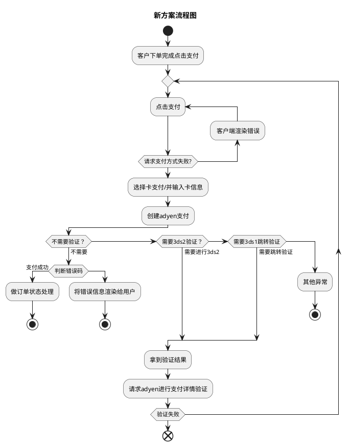
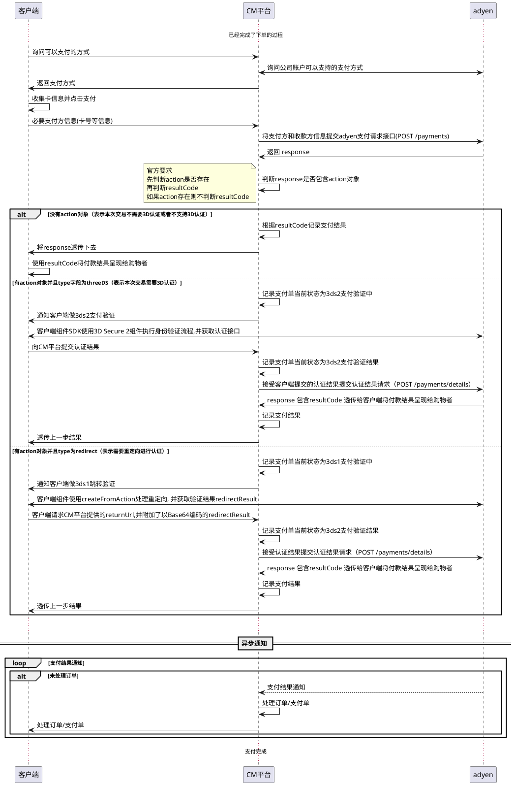
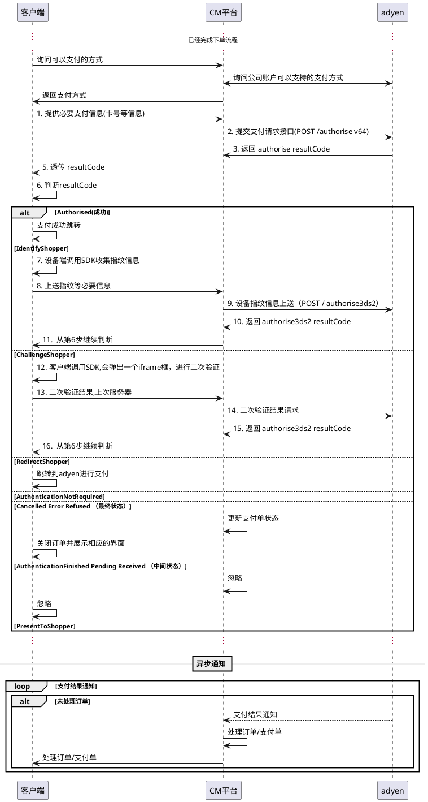

# 3ds支付
[toc]

## 概述
- adyen平台下的一种支付校验模式

## 需求
- 需要对卡支付进行3ds支付校验

## 接入方案
- 最新用法方案
    - 概述: 支付时进行3ds支付， 对平台来说研发逻辑基本一致。具体参数可能有区别
    - 相关SDK版本信息:
        - 平台: V67 last
        - web: 
        - IOS: 
        - Android: 
    - 1. 新方案-嵌入方式： 
        - 优点: 前端集成快速, UI是多合一的解决方案
        - 缺点: 对UI的控制力度小
    - 2. 新方案-组件方式:
        - 优点: 可以每一种支付方式有单独UI组件, 可以在一定程度在自定义（需要前端同学确定自定义力度）
        - 缺点: 前端集成相比于嵌入方式要复杂
    - 3. 新方案-纯API接入方式:
        - 优点: 完全可以自定义UI
        - 缺点: 集成最慢
- 旧用法方案
    - 概述: 授权支付方案, 到账时间决定于capture时间，是否自动。从授权到支付的中间有时间窗口，非原子性。
    - 4. 3ds授权支付方案
        - 缺点: 授权后钱仍然在用户卡上，存在欺诈。 （***待确定？？？？***）

### 最新方案
- 主要有3个步骤
    - 1. 获取支付方式
    - 2. 支付方式3ds验证
    - 3. 拿验证结果请求支付
    
#### 流程图

#### 最新方案

- resultCode 说明：
    - Authorised（付款成功）-> 通知购物者付款已成功
    - Cancelled（付款被取消）-> 询问购物者是否要继续订购，或要求他们选择其他付款方式
    - Error（出错，原因包含在resultReason字段中）-> 通知购物者处理他们的付款时出错
    - Refused（拒绝，原因包含在resultReason字段中）-> 要求购物者使用其他付款方式再次尝试付款

### 旧用法方案接入时序图

## 参考文档
- 在线支付概述: https://docs.adyen.com/online-payments
- drop-in接入: https://docs.adyen.com/online-payments/drop-in-web
- components接入: https://docs.adyen.com/online-payments/components-web
- 纯API接入方式: https://docs.adyen.com/online-payments/api-only
- 3ds2接入文档: https://docs.adyen.com/online-payments/3d-secure/native-3ds2
- 老方案接入: https://docs.adyen.com/online-payments/classic-integrations/api-integration-ecommerce/3d-secure
- API接口文档: https://docs.adyen.com/api-explorer/#/CheckoutService/v67/overview

## Q&A
1. /payments 请求/应答reference
    1. request会传两个
        - order.pspReference :  交易单ID
        - reference : 订单ID
    2. response 有3个
        - 返回请求两个
        - pspReference adyen下唯一交易单, 
    
2. 是否会产生循环跳转支付？
答： 就目前的文档阐述而言，是不会发生的。（调试时验证下） 

3. 3d1/3d2响应吗范围
答: 参考官网 

