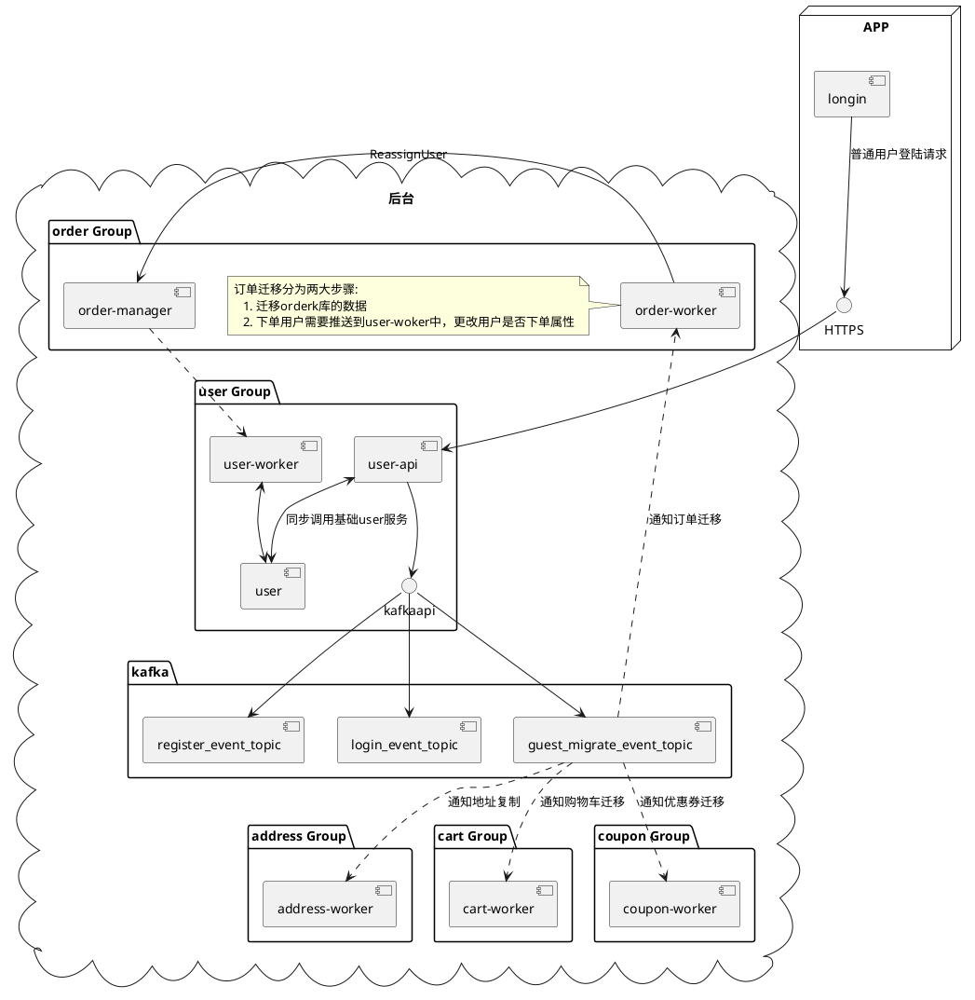
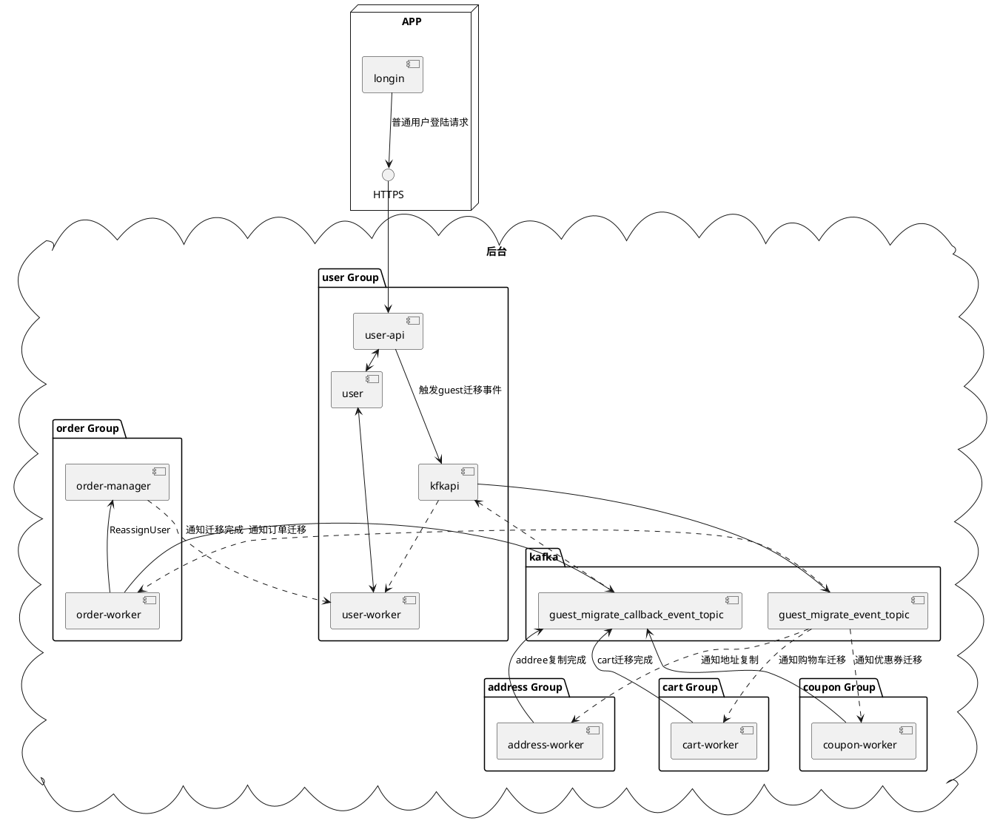
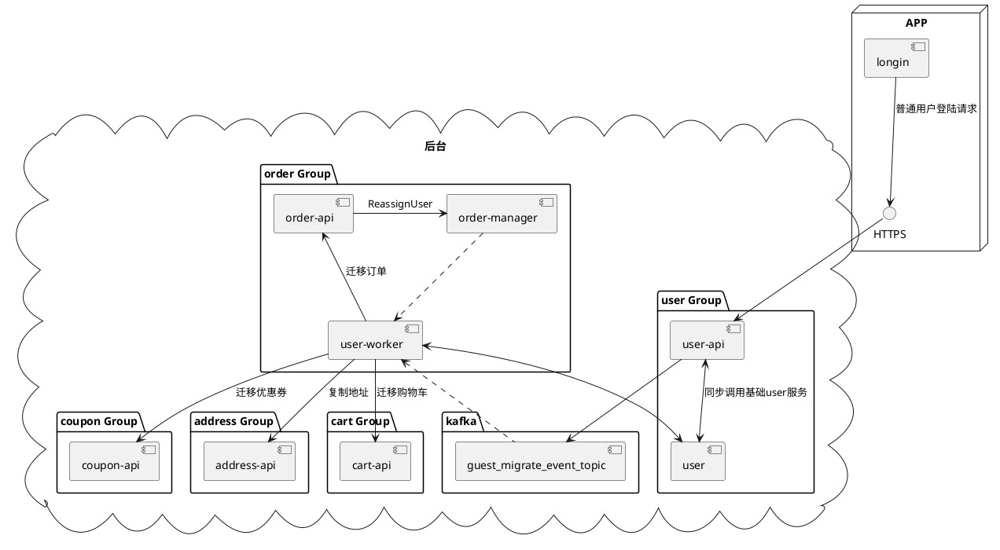

# guest用户再次支付
[toc]

## 1. 概述
- issues: https://gitlab.momoso.com/cm/demands/-/issues/304
- 背景: 
    - 匿名用户支付之后，有保留地址信息，没有保留支付信息。无法做二次一件支付。
    - 匿名用户支付之后兑换优惠券，再注册，无法将guest用户券绑定给注册用户；（历史原因，设计券类型时专门区分了注册用户可用券&guest用户可用券）

- 需求目标
  - 通过绑定guest用户支付信息、地址、优惠券等权益给其注册后用户，提升这种情况下用户购物体验；
  - 记录guest用户支付信息，帮助其更方便的复购

- 设计方案
    - 1. 对guest用户增加登陆态处理
    - 2. guest用户切换到普通用户登陆时，进行异步数据迁移

## 2. 问题
- 解决问题
    - guest用户需要重复输入卡号来进行支付，无法快捷使用已经支付过的卡号进行支付
    - 切换成普通用户时，优惠券重复领取（原有bug）

## 3. 目标
- guest用户，可以快速下单支付
- guest用户登陆后，可以保留要有地址，支付等信息

## 4. 目标边界
- 数据库表保留原有地方，先不内聚

## 5. 设计方案
- **guest用户增加了登陆态，登陆时间是app启动的第一时间**，登陆后通过消息队列发放优惠券等。 guest登陆后可以再次支付快速下单。 当guest用户使用firebase登陆时，通过异步消息队列来完成guest用户数据迁移到普通用户的过程

### 5.1. 处理场景
- 登陆注册场景， 生成用户token返回 （同步场景）
- 注册登陆事件广播（异步场景）
    - 优惠券发放
- guest用户的相关信息迁移到普通用户下（首次登陆-异步场景）
    - 地址信息(复制)
        - 方案: 数据直接迁移
    - 订单信息(迁移)
        - 方案: 数据直接迁移
    - 优惠券信息(迁移)
        - 方案: 数据直接迁移
    - 购物车信息(迁移)
        - 方案: 数据直接迁移
    - 用户信息（建立绑定关系）
        - 方案: 写一条关联数据
    - 支付卡号(建立绑定关系)
        - 方案: 使用中间表保存，两个用户之间的关系， 当普通用户使用原来的guest用户的卡支付时，通过中间表来找到adyen原有shoppingReference,然后请求adyen授权支付,进而达到支付目的

### 5.2. 通讯时许图
- guest用户和普通用户的登录时许

```plantuml
== guest用户 ==
... 用户安装app/推出普通用户登陆...
app -> 后台 : guest用户登陆，调用接口：/guest/login
note left
app会在第一时间，登陆注册guest账户，
所以后续操作都是在guest登陆态的场景下
end note
后台 -> app : 返回登陆token
...
loop
... 其他操作 ...
app <-> 后台 : 兑换优惠券
app <-> 后台 : 添加地址
app <-> 后台 : 下单购物
... 其他操作 ...
end
...
== 普通用户 ==
app -> 后台 : 普通用户登陆，调用接口：/login （需带上guest_token）
note left
只有这一个时间节点是有两个token信息请求，
其他时间点都只有当前已登陆的用户token 
end note
后台 --> 后台 : 迁移guest用户相关信息到普通用户下
后台 -> app : 返回登陆token
note right
利用普通用户登陆后的时间窗口来异步完成迁移，
这个时间窗口主要来自用户操作的时差
end note

... 用户其他操作 ...

```
    
### 5.3. guest信息迁移后台设计方案
- 先采用目前设计方案， 优化方案需要等到老python项目迁移后方可执行

#### 5.3.1. 目前设计方案
- 在guest用户切换成普通用户时，在user-login接口中，只想两个事件（登陆事件 和 guest信息迁移事件，然后在订单/用户/优惠券/地址/购物车的worker服务中，监听迁移事件。一旦收到迁移事件，则各自完成迁移动作。
- todo:
    - 目前有数据库所在位置依旧是原来的位置，需要修改DB位置
    - 逻辑没有形成闭环，需要加上完成通知或者同步迁移




#### 5.3.2. 后续优化设计方案
- 优化方案1:
    - 再上述方案中，实现todo逻辑
        - 目前有数据库所在位置依旧是原来的位置，需要修改DB位置
        - 逻辑没有形成闭环，需要加上完成通知或者同步迁移(采用slice做存储)
    - 优点: 代码耦合小，方便扩展
    - 缺点: 异步操作，闭环的时候稍微复杂



- 优化方案2:
    - user-api服务通过kafka通知到user-worker, 然后user-worker来同步迁移. 
        - 迁移前需要加分布式锁，迁移完成后打上标记，做幂等处理。
    - 优点: 轻松形成代码闭环
    - 缺点: 代码耦合大，不方便扩展



## 修改服务
- 1. **user**
    - guest upsert 注册事件
- 2. **user-api** 
    - 增加guestlogin
    - login增加guestmigrate事件
    - 对user服务版本有依赖，请求到老版本user有问题
- 3. **cart**
    - loginhandle 迁移优化 
- 4. cart-worker
    - 增加guestID 到 userID 购物车迁移
    - 对cart服务版本有依赖，请求到老版本cart有问题
- 5. order-worker
    - 增加guestID 到 userID 订单迁移
- 6. payment-worker
    - 增加guestID 到 userID 卡号迁移
- 7. **payment**
    - 修改Authorise接口
    - 修改RecurringDetails接口
    - 请求到老版本的payment，会无法拿到guest迁移的卡号
- 8. **address**
    - 优化migrate接口
- 9. address-worker
    - 增加guestID 到 userID 地址迁移
    - 对address有强依赖，请求到旧服务会导致，地址存在多份
- 10. coupon-worker
    - 增加guestID 到 userID 优惠券迁移
- 11. **coupon**
    - 优化对券逻辑
    - 请求到老coupon，可能会出现重复对券的问题
- 12. **noti**
    - 优化guest email发送
    - 优化安卓noti url
    - 请求到老服务，发邮件会有问题
- 13. **coupon-new-user**
    - 取消guest新人券逻辑
    - 需要全量更新，请求到老服务会出现重复发券问题


## Q&A
- Q: noti通知方式确认？是否和原有逻辑一致？
  A:
  
  
  
  
  


