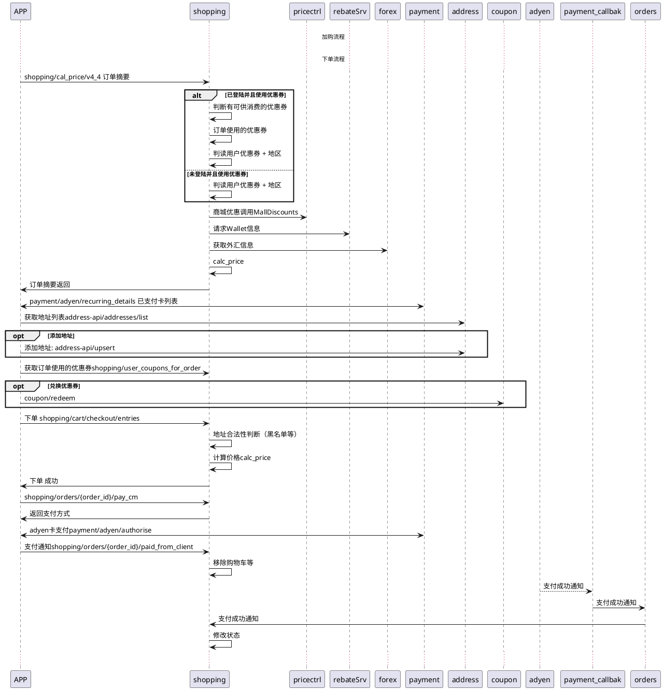

# 用户下单流程

## 后台时序图

## 订单状态图

## 重构方案
- 总体目标QPS达到1000

### 方案一
继续在python老代码上改动， 将不需要的服务调用全部移除

### 方案二
- 保留现有DB结构和kafka通信链路，使用golang重写目前在使用的几个接口
    - shopping/cal_price/v4_4 ---- 订单摘要
    - shopping/user_coupons_for_order -- 获取订单使用的优惠券
    - shopping/cart/checkout/entries -- 下单
    - shopping/orders/{order_id}/pay_cm ---获取支付方式
    - shopping/orders/{order_id}/paid_from_client  ----告诉后台支付成功
    - event/payment_notified_cm 支付成功事件处理
    - event/payment_failed_cm 支付失败事件处理
    - event/purchased 购买事件处理
    - event/refund_notified 退款处理
    - event/* 其他事件处理
    

### 方案三