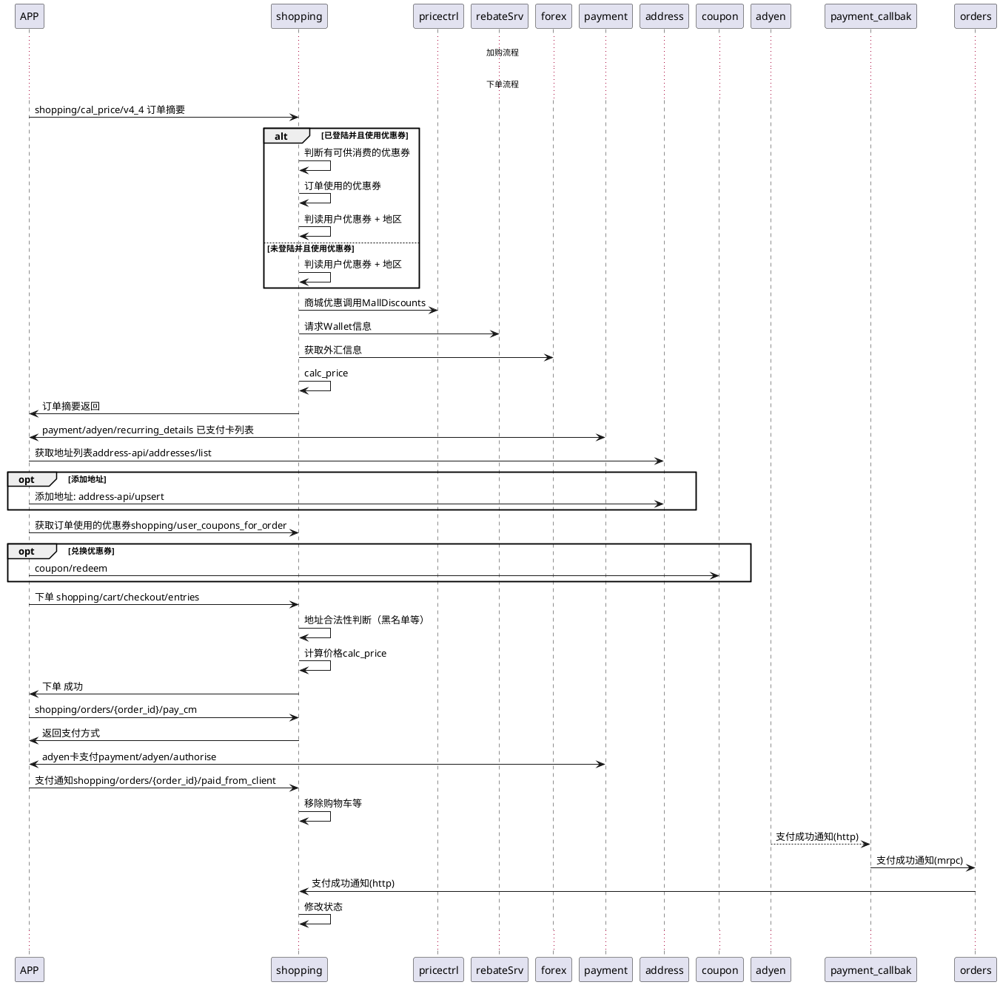

# shopping项目重构
## 1. 概述
## 2. 问题
## 3. 目标
- 总体目标QPS达到1000
 
## 4. 任务明细
- 1. 订单状态图分析（目前分析了前半部分，后半部还没有） 4h
- 2. 对app提供同步接口定义 8h
- 3. 支付相关异步通知接口定义 4h
- 4. noti相关接口定义 4h
- 5. 订单摘要研发（计价接口）24h
    - 5.1. 订单摘要-访问库表及字段调研
    - 5.2. 订单摘要-流程设计
    - 5.3. 订单摘要-完成研发
    - 5.4. 订单摘要-自测（需要测试同学配合-场景配置）
    - 备注：返回商品详情数据（附加任务）
- 6. 订单使用优惠券列表 16h
    - 6.1. 访问库表和服务调研
    - 6.2. 流程设计和完成研发
    - 6.3. 订单使用优惠券-自测（需要测试同学配合-场景配置）    
- 7. app下单接口(逻辑很长) 32h
    - 7.1. app下单-访问库表及字段调研
    - 7.2. app下单-流程设计
    - 7.3. app下单-完成研发
    - 7.4. app下单-自测（需要测试同学配合-场景配置）
- 8. 获取订单支付方式（目前是代码里写死的）8h
    - 8.1. 支付方式-流程设计
    - 8.2. 支付方式-研发
    - 8.3. 支付方式-自测（需要测试同学配合-场景配置）
- 9. app通知支付成功接口（主要是删除购物车数据）（4h）
    - 9.1. 支付方式-研发
    - 9.2. 支付方式-自测
- 10. 支付成功事件处理（两种场景，authorized/captured）(12h)
    - 10.1. 支付成功事件-写入库表及字段调研
    - 10.2. 支付成功事件-研发
    - 10.3. 支付成功事件-自测
    - 备注: paypal 的authorized状态在callback过滤了
- 11. 支付失败事件 12h
    - 11.1. 支付失败事件-写入库表及字段调研
    - 11.2. 支付失败事件-研发
    - 11.3. 支付失败事件-自测
- 12. 购买事件处理（event/purchased）8h
    - 12.1. 购买事件处理-使用场景调研
    - 12.2. 购买事件处理-研发
    - 12.3. 购买事件处理-自测
- 13. 其他事件 (*h)
    - 13.1. event/group_update使用场景调研（接口是否已经废弃）
- 14. 退款处理接口（成功/失败/失败等场景）(32h)
    - 14.1. 退款接口调用（工单）
    - 14.2. 退款接口使用场景/调用链/库表字段调研
    - 14.3. 退款接口-研发
    - 14.4. 退款接口-测试（需要模拟写入退款相关数据）
    - 14.5. 退款结果通知事件-流程/库表调研
    - 14.6. 退款结果通知事件-研发
    - 14.7. 退款结果通知事件-测试
- 15. 模拟物流数据 (*h)
    - 15.1. 构造物流数据（模拟履约）
    - 15.2. 创建物流通知消息（模拟履约）
    - 15.3. 物流消息的处理接口（平台）
    - 使订单的状态可以顺利的从 收货中 ---> 收获完成
- 16. noti接口（16h）
- 17. 订单列表适配 (*h)
    - 17.1. 前端订单列表适配
    - 17.2. 后台管理界面订单列表适配
    - 整个下单流程的状态/信息显示验证

### 
    
    
## 5. 设计方案
- 第一阶段选用方案2

### 方案一
继续在python老代码上改动， 将不需要的服务调用全部移除

### 方案二
- 保留现有DB结构和kafka通信链路，使用golang重写目前在使用的几个接口
    - shopping/cal_price/v4_4 ---- 订单摘要
    - shopping/user_coupons_for_order -- 获取订单使用的优惠券
    - shopping/cart/checkout/entries -- 下单
    - shopping/orders/{order_id}/pay_cm ---获取支付方式
    - shopping/orders/{order_id}/paid_from_client  ----告诉后台支付成功
    - event/payment_notified_cm 支付成功事件处理
    - event/payment_failed_cm 支付失败事件处理
    - event/purchased 购买事件处理
    - refund/refund 退款接口处理
    - event/refund_notified 退款结果处理
    - event/* 其他事件处理
    - noti相关接口    

### 方案三
- 微服务库内聚
- 微服务DB隔离，不能夸服务访问其他的库
- 业务流程重理

## 后台时序图

### Q&A
- Q: 对orders服务的依赖
- A:
    - 1.下单接口
    - 2. 支付事件通知
    - 3. noti事件通知
