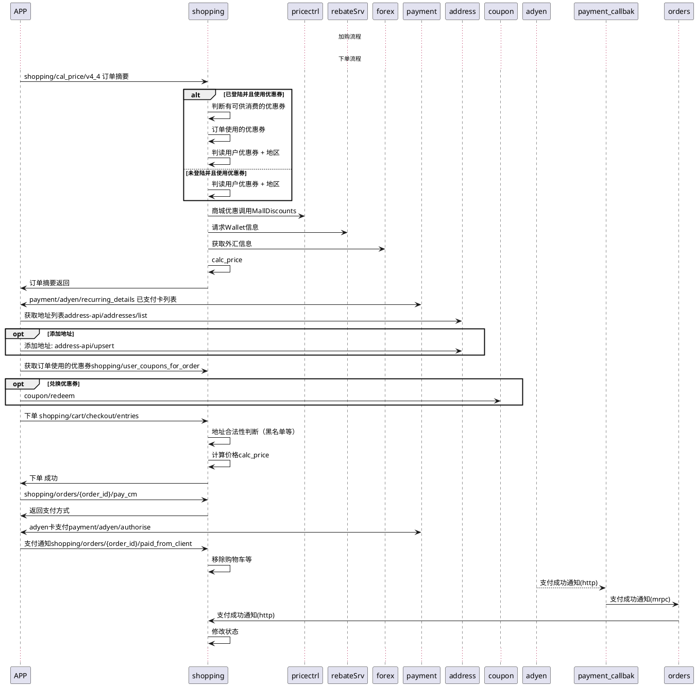

# shopping项目重构
- https://gitlab.momoso.com/groups/cm/tasks/-/milestones/16
## 1. 概述
## 2. 问题
- 优惠quan: 
    - 是否只有优惠券优惠
- 物流渠道: 是否只有一个？
- 关税的收取方式是什么，根据单收，还是根据商品收
- 佣金Commission， 还有没有 
    
## 3. 目标
- 总体目标QPS达到1000
 
## 4. 任务明细
- 1. 订单状态图分析（目前分析了前半部分，后半部还没有） 
- 2. 对app提供同步接口定义 
- 3. 支付相关异步通知接口定义 
- 4. noti相关接口定义 
- 5. 订单摘要研发（计价接口）
    - 5.1. 订单摘要-访问库表及字段调研
    - 5.2. 订单摘要-流程设计
    - 5.3. 订单摘要-完成研发
    - 5.4. 订单摘要-自测（需要测试同学配合-场景配置）
    - 备注：返回商品详情数据（附加任务）
- 6. 订单使用优惠券列表 
    - 6.1. 订单使用优惠券列表-访问库表和服务调研
    - 6.2. 订单使用优惠券列表-流程设计和完成研发
    - 6.3. 订单使用优惠券列表-订单使用优惠券自测（需要测试同学配合-场景配置）    
- 7. app下单接口(逻辑很长) 
    - 7.1. app下单-访问库表及字段调研
    - 7.2. app下单-流程设计
    - 7.3. app下单-完成研发
    - 7.4. app下单-自测（需要测试同学配合-场景配置）
- 8. 获取订单支付方式（目前是代码里写死的）
    - 8.1. 支付方式-流程设计
    - 8.2. 支付方式-研发
    - 8.3. 支付方式-自测（需要测试同学配合-场景配置）
- 9. app通知支付成功接口（主要是删除购物车数据）
    - 9.1. app通知支付成功接口-研发
    - 9.2. app通知支付成功接口-自测
- 10. 获取订单详情(v_43， 只有web使用) 
    - 10.1. 获取订单详情v_43-访问库表及字段调研 
    - 10.2. 获取订单详情v_43-研发
    - 10.3. 获取订单详情v_43-自测
- 11. Paypal支付请求
    - Paypal支付请求-流程调研
    - Paypal支付请求-接口研发
    - Paypal支付请求-自测
- 12. Paypal支付完成后通知服务器
    - Paypal支付完成后通知服务器-流程调研
    - Paypal支付完成后通知服务器-研发
    - Paypal支付完成后通知服务器-自测
- 13. adyen支付请求
    - adyen支付请求-流程调研
    - adyen支付请求-研发
    - adyen支付请求-测试
- 14. 支付成功事件处理（两种场景，authorized/captured）
    - 14.1. 支付成功事件-写入库表及字段调研
    - 14.2. 支付成功事件-研发
    - 14.3. 支付成功事件-自测
    - 备注: paypal 的authorized状态在callback过滤了
- 15. 支付失败事件 
    - 15.1. 支付失败事件-写入库表及字段调研
    - 15.2. 支付失败事件-研发
    - 15.3. 支付失败事件-自测
- 16. 购买事件处理（event/purchased）
    - 16.1. 购买事件处理-使用场景调研
    - 16.2. 购买事件处理-研发
    - 16.3. 购买事件处理-自测
- 17. 其他事件 (*h)
    - 17.1. event/group_update使用场景调研（接口是否已经废弃）
- 18. 退款处理接口（成功/失败/重试等场景）
    - 18.1. 退款接口调用（工单）
    - 18.2. 退款接口使用场景/调用链/库表字段调研
    - 18.3. 退款接口-研发
    - 18.4. 退款接口-测试（需要模拟写入退款相关数据）
    - 18.5. 退款结果通知事件-流程/库表调研
    - 18.6. 退款结果通知事件-研发
    - 18.7. 退款结果通知事件-测试
- ~~19. 模拟物流数据 (*h)~~
    - ~~19.1. 构造物流数据（模拟履约）~~
    - ~~19.2. 创建物流通知消息（模拟履约）~~
    - ~~19.3. 物流消息的处理接口（平台）~~
    - ~~使订单的状态可以顺利的从 收货中 ---> 收获完成~~
- 20. noti接口
- 21. 订单列表适配 (*h)
    - 21.1. 前端订单列表适配
    - 21.2. 后台管理界面订单列表适配
    - 整个下单流程的状态/信息显示验证

### 
    
### nginx 反向代理
- 计价接口
    - from: ***/shopping/cal_price/v4_4
    - to: ***/order2/calc_price
- 订单可以使用的优惠券
    - from: ***/shopping/user_coupons_for_order
    - to: ***/order2/coupons
- 下单
    - from: ***/shopping/cart/checkout/entries
    - to: ***/order2/place_order
- 获取订单详情
    - from: ***/shopping/orders_v43/${orderId}
    - to: ***/order2/detail/{order_id}
- Paypal支付
    - from: ***/shopping/orders/<order_id>/pay/<ptype>/paypal
    - to: ***/order2/paypal/pay/{ptype}/{order_id}
- paypal 支付完成后通知服务器
    - from: ***/shopping/orders/<order_id>/paypal_finished/<pay_id>
    - to: ***/order2/Paypal/{order_id}/{pay_id}
- AdyenPay 订单付款
    - from: ***/shopping/orders/<order_id>/pay/any/adyen
    - to: ***/order2/adyen/any/{order_id} 
- 获取支付方式
    - from: ***/shopping/orders/{order_id}/pay_cm
    - to: ***/order2/payment_methods/{order_id}
- 客户端通知支付成功
    - from: ***/shopping/orders/{order_id}/paid_from_client
    - to: ***/order2/paid_from_client/{order_id}

## 5. 设计方案
- 第一阶段选用方案2

### 方案一
继续在python老代码上改动， 将不需要的服务调用全部移除

### 方案二
- 保留现有DB结构和kafka通信链路，使用golang重写目前在使用的几个接口
    - shopping/cal_price/v4_4 ---- 订单摘要
    - shopping/user_coupons_for_order -- 获取订单使用的优惠券
    - shopping/cart/checkout/entries -- 下单
    - shopping/orders/{order_id}/pay_cm ---获取支付方式
    - shopping/orders/{order_id}/paid_from_client  ----告诉后台支付成功
    - event/payment_notified_cm 支付成功事件处理
    - event/payment_failed_cm 支付失败事件处理
    - event/purchased 购买事件处理
    - refund/refund 退款接口处理
    - event/refund_notified 退款结果处理
    - event/* 其他事件处理
    - noti相关接口    

### 方案三
- 微服务库内聚
- 微服务DB隔离，不能夸服务访问其他的库
- 业务流程重理

## 后台时序图

### 计价时序图
### 下单时序图
### 退款时序图
### 物流时序图

### 会议纪要

#### 2021-05-24
- 会议时间: 2021-05-24
- 研发
    - 本周完成研发
    - 下周完成自测
- 测试
    - 测试场景（周三上午完成） （会议）
    - 测试数据（下周二之前） 
    
- 环境
    - shopping独立调试环境（周三上午完成）

- 提测
    - 提测之前，定义发布流程（会议）

#### 2021-05-26
- 会议时间: 2021-05-26
    - 确认web下单ios支付，订单支付金额会变更
    - 优先测试5.10.0 版本， 老版本可以延后保证
    - calcPrice/placeOrder接口需要压测
    - 废弃shopping/v_43/detail接口，统一接order-api/detail (web 后期版本规划)
    - 废弃shopping/pay相关接口，统一接payment服务(ios 后期版本规划)
    - calcPrice给出订单详情数据（后期规划）
- 时间节点
    - 研发
        - 明天给出nginx反向代理映射
    - 测试
        - 明天给出部分测试数据
    - 运维
        - 明天给出独立shopping测试环境
    - 进度跟踪
        - 下周一上午

#### 2021-06-07
- 会议时间: 2021-06-07
    - 研发
        - 周二之前跑通下单接口
        - 本周之前完成自测
    - 运维
        - 周二完成shopping环境的搭建
        - nginx 所在机器权限
    - 测试
        - 基于新shopping环境，核对测试数据
        
    - 模拟物流数据
        - 接口自测完成后开始
        - 备用方案（通过预发布环境验证）
    
    -  下次会议时间
        -  2021-06-11
        -  需要讨论的会议类容
            -  定义发布流程
            -  提测流程
    
#### 2021-06-15
- 会议时间: 2021-06-15
    - 研发
        - 周二同步场景测试结果
    - 运维
        - 今天完成场景部署
        - 完成web前端搭建
    - 测试
        - 明天完成场景数据核对
    
    
#### 2021-06-16
- 会议时间: 2021-06-16
    - 研发
        - 接口研发完成，测试环境场景通过
        - 物流系统模拟（备选方案:在预发布环境验证）
        - 给出发布清单和配置清单
    - 运维
        - shopping环境搭建完成
        - 部署oss系统+jupyter系统（不部署，无法配置优惠券/折扣等）
        - oss销售报表系统
        - 免邮门槛 --- 拷贝线上数据
        - 功能测试时-需要部署mongo集群
        
    - 测试
        - 场景数据核对（除优惠券外的数据已经核对完成）
        - 测试流程
            - 6.17--6.18 接口测试（需要数据合法性校验）
            - 6.19--6.25 功能测试（优先5.10.0功能测试）
            - 6.19--6.25 性能测试
            - 6.18--6.30 预发布环境功能测试
        
    - 发布流程（暂定）
          - ~~需要等待5.11.0发布成功后，才能上线shopping项目~~
        - 6.28 发布到预发布环境
        - 发布流程
            - 暂定一轮内测（在预发布环境）
            - 内测后开始灰度
                - 灰度占比: 10% -> 20% -> 50% -> 80% -> 100%
                - 每轮灰度三天
        
###  后续规划
- 废弃shopping/v_43/detail接口，统一接order-api/detail (web)
- 废弃shopping/pay相关接口，统一接payment服务(ios)

### Q&A
- Q: 对orders服务的依赖
- A:
    - 1.下单接口
    - 2. 支付事件通知
    - 3. noti事件通知
