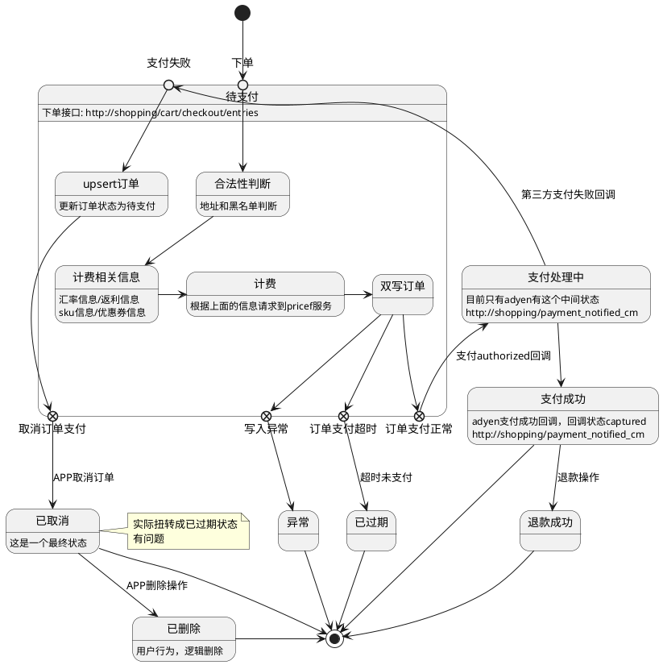

# 订单状态

## 订单状态

- 待支付: PAYMENT_PENDING 
- 支付处理中: PAYMENT_CONFIRMING 
- 支付成功: PAYMENT_RECEIVED 
- 已取消: CANCELLED 
- 异常状态: ABNORMAL 
- 订单删除: ORDER_DELETED 
- 已过期: EXPIRED 
- 自动下单: AUTO_ORDERED -- 移动到履约系统
- 已退款: REFUNDED 
- 已退款: RETURNED 
- 商铺处理: MALL_ORDERED -- 移动到履约系统
- 商铺发货: MALL_SHIPPED -- 移动到履约系统
- 商品入库: WAREHOUSE_IN -- 移动到履约系统
- 发往您所在地: WAREHOUSE_OUT -- 移动到履约系统
- 航班到港: PORT_ARRIVED -- 移动到履约系统
- 清关: CUSTOM -- 移动到履约系统
- 缴纳关税: PAID_TAX -- 移动到履约系统
- 派件: DOMESTIC -- 移动到履约系统
- 已完成: RECEIVED -- ？？？
- 退款中: REQUEST_RETURN -- ？？？
- 退款中: PENDING_RETURN -- ？？？
- 退款中: RETURNING -- ？？？

## 订单消息状态

- CREATE
- PAID
- REFUNDED
		